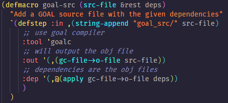
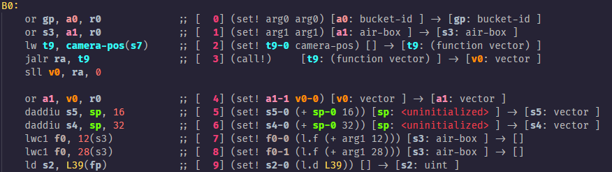

# OpenGOAL for VSCode

Provides syntax highlighting, snippets, and more for the OpenGOAL language and it's related languages as well - https://open-goal.github.io

Therefore, this repo also contains TextMate grammars for the languages that you should be able to use for any other editor if you so choose.

## Features

- Syntax Highlighting for `.gc` (OpenGOAL) files
- Syntax Highlighting for `*_ir2.asm` (OpenGOAL IR) files
  - Supports embedded highlighting for OpenGOAL blocks
- File Icons distinct for each sub-language

## Example Screenshots

OpenGOAL Syntax Highlighting:

OpenGOAL IR Syntax Highlighting:

